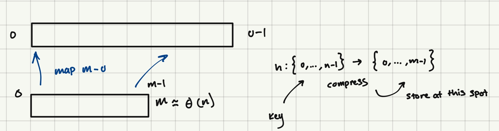
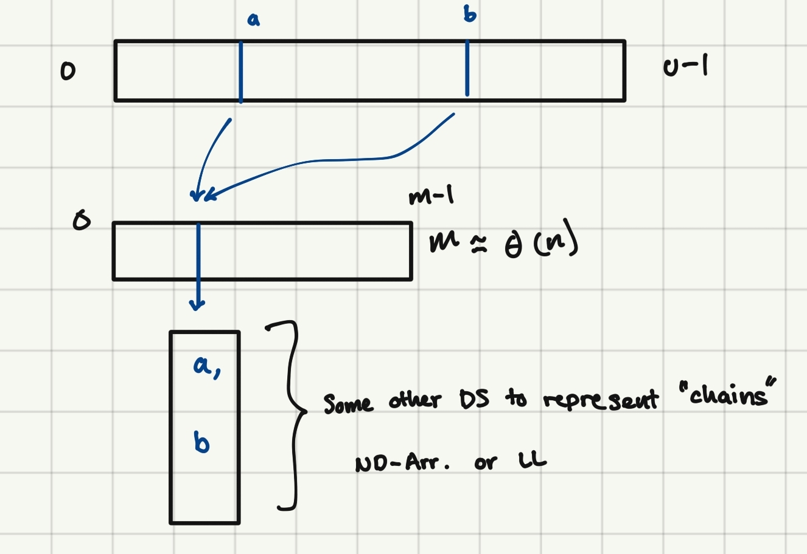

# Set Interface
| Data Structure | Container | Static  | Dynamic   | Order      | Order        |
|----------------|-----------|---------|-----------|------------|--------------|
|                | build(x)  | find(k) | insert(x) | find_min() | find_prev(k) |
|                |           |         | delete(k) | find_max() | find_next(k) |
|----------------|-----------|---------|-----------|------------|--------------|
| Array          | n         | n       | n         | n          | n            |
| Sorted Array   | nlogn     | logn    | n         | 1          | logn         |
|----------------|-----------|---------|-----------|------------|--------------|

## Hashing
- Prove that you can't find(k) faster than O(logn) time
    - If in a constrained model
- Show how to find(k) faster than O(logn) time
    - If not in a constrained model

`Recall: find(k) - means to search items stored and to return item associated with key if given`

## Comparision Model 
* In a comparision model we can think of the items we are storing as 'black boxes'
    * The way to distinguish between them - given a key of two items we can make a comparision (are they larger/smaller) but we can not look at the value
        * View an algorithim in this model as a **decision tree**

* Branch what can be done based on the evaluation of the comparitor - this creates a **binary tree**
    * *How many leaves must there be in the tree?*
        * Recall: the leaves represent the number of outputs
        * So if we're storing n thing we need at least n+1 outputs to store all of n values an +1 in case the value is not present
            - tl;dr we need n+1 total leaves 
    * *How many comparisions does this algorithim must do?*
        * In the worst case we need as many comparisions as the 'longest root-leaf path'
            * So time is bound by the time it takes to traverse the height of the tree (longest path is the height of the tree)
    * *What is the minimum height of the binary tree of any bt with n+1 leaves?*
        * The best case is that the tree is balanced - thus the min height is at least **logn**

* How can we do this faster? 
    * Note: comparisions are limited by their branching factor (2 per operation)
    * Recall the RAM model:
        * We can go to any place in memory in constant time based an a index
    * Suppose I have an item with key=10, we can store that item at pos. ind=array+10  - **Direct Acess Array**
        * Since we're working with an array directly in memory:
            - Lookups = O(1)
            - Ins/Del = O(1)
        * *Why not use this always*
            * We don't know how large the numbers to be stored are
                * Consider storing a 9-digit ID
                * So if we were to store IDs as keys - we would need indices that span that entire space
                * So to use a DAA we would need 10^9 indices to store
                * U = is the max size of any number to be stored; the size of the largest key
                * To instantiate a DAA of size U we need to allocate that much space

| Data Structure      | Container | Static  | Dynamic   | Order      | Order        |
|---------------------|-----------|---------|-----------|------------|--------------|
|                     | build(x)  | find(k) | insert(x) | find_min() | find_prev(k) |
|                     |           |         | delete(k) | find_max() | find_next(k) |
|---------------------|-----------|---------|-----------|------------|--------------|
| Array               | n         | n       | n         | n          | n            |
| Sorted Array        | nlogn     | logn    | n         | 1          | logn         |
| Direct Acesss Array | u         | 1       | 1         | u          | u            |
|---------------------|-----------|---------|-----------|------------|--------------|

So if u > n then we're using way more space
    - and if data is stored in a non-contigous way we would also need to scan down the DAA to find the right element

u => largest key ; assuming ints as keys

* *How can we be assured that these keys can be lookedup in 0(1) time?*
    * Recall word RAM model of computation 
        *  The CPU has a number of registers we can act upon (x64) = the size of a word 
            * So we have 2^64 addresses we can acess directly 
                * This also means that to ensure that a DAA works in 0(1) time then u < 2^w must hold
                * `Recall: word size represents the # of bits our machine can do operations on in constant time`
            * If u > 2^w then we must use some other structure

### So the problem is - we use way too much space for the entire universe of keys

#### How can we address this issue?

We can instead of using an array from [0, u-1] we can make an array of size [0, m-1] by creating some function `h` that maps the indices of n->m 

What's the problem though? 
- We may have to store >1 things at the same index location 
    - If we're going from a large -> smaller space it makes sense that there would be overlap between elements; else size would be constant
        - Hence we want a function that will 'evenly distribute' keys to the smaller space

So we have two options for dealing with overlaps:
- Open Addressing (stick it in some open spot in the arr.)
- Chaining:
    -  

31:100 end time
