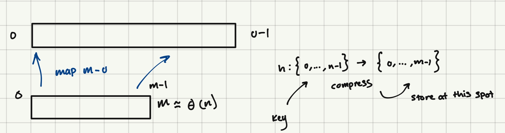
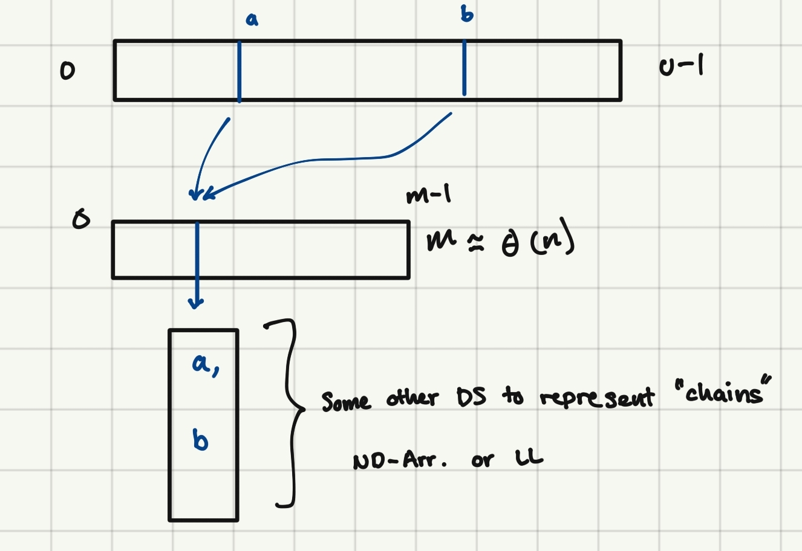

# Set Interface
| Data Structure | Container | Static  | Dynamic   | Order      | Order        |
|----------------|-----------|---------|-----------|------------|--------------|
|                | build(x)  | find(k) | insert(x) | find_min() | find_prev(k) |
|                |           |         | delete(k) | find_max() | find_next(k) |
|----------------|-----------|---------|-----------|------------|--------------|
| Array          | n         | n       | n         | n          | n            |
| Sorted Array   | nlogn     | logn    | n         | 1          | logn         |
|----------------|-----------|---------|-----------|------------|--------------|

## Hashing
- Prove that you can't find(k) faster than O(logn) time
    - If in a constrained model
- Show how to find(k) faster than O(logn) time
    - If not in a constrained model

`Recall: find(k) - means to search items stored and to return item associated with key if given`

## Comparision Model 
* In a comparision model we can think of the items we are storing as 'black boxes'
    * The way to distinguish between them - given a key of two items we can make a comparision (are they larger/smaller) but we can not look at the value
        * View an algorithim in this model as a **decision tree**

* Branch what can be done based on the evaluation of the comparitor - this creates a **binary tree**
    * *How many leaves must there be in the tree?*
        * Recall: the leaves represent the number of outputs
        * So if we're storing n thing we need at least n+1 outputs to store all of n values an +1 in case the value is not present
            - tl;dr we need n+1 total leaves 
    * *How many comparisions does this algorithim must do?*
        * In the worst case we need as many comparisions as the 'longest root-leaf path'
            * So time is bound by the time it takes to traverse the height of the tree (longest path is the height of the tree)
    * *What is the minimum height of the binary tree of any bt with n+1 leaves?*
        * The best case is that the tree is balanced - thus the min height is at least **logn**

* How can we do this faster? 
    * Note: comparisions are limited by their branching factor (2 per operation)
    * Recall the RAM model:
        * We can go to any place in memory in constant time based an a index
    * Suppose I have an item with key=10, we can store that item at pos. ind=array+10  - **Direct Acess Array**
        * Since we're working with an array directly in memory:
            - Lookups = O(1)
            - Ins/Del = O(1)
        * *Why not use this always*
            * We don't know how large the numbers to be stored are
                * Consider storing a 9-digit ID
                * So if we were to store IDs as keys - we would need indices that span that entire space
                * So to use a DAA we would need 10^9 indices to store
                * U = is the max size of any number to be stored; the size of the largest key
                * To instantiate a DAA of size U we need to allocate that much space

| Data Structure      | Container | Static  | Dynamic   | Order      | Order        |
|---------------------|-----------|---------|-----------|------------|--------------|
|                     | build(x)  | find(k) | insert(x) | find_min() | find_prev(k) |
|                     |           |         | delete(k) | find_max() | find_next(k) |
|---------------------|-----------|---------|-----------|------------|--------------|
| Array               | n         | n       | n         | n          | n            |
| Sorted Array        | nlogn     | logn    | n         | 1          | logn         |
| Direct Acesss Array | u         | 1       | 1         | u          | u            |
|---------------------|-----------|---------|-----------|------------|--------------|

So if u > n then we're using way more space
    - and if data is stored in a non-contigous way we would also need to scan down the DAA to find the right element

u => largest key ; assuming ints as keys

* *How can we be assured that these keys can be lookedup in 0(1) time?*
    * Recall word RAM model of computation 
        *  The CPU has a number of registers we can act upon (x64) = the size of a word 
            * So we have 2^64 addresses we can acess directly 
                * This also means that to ensure that a DAA works in 0(1) time then u < 2^w must hold
                * `Recall: word size represents the # of bits our machine can do operations on in constant time`
            * If u > 2^w then we must use some other structure

### So the problem is - we use way too much space for the entire universe of keys

#### How can we address this issue?

We can instead of using an array from [0, u-1] we can make an array of size [0, m-1] by creating some function `h` that maps the indices of n->m 

What's the problem though? 
- We may have to store >1 things at the same index location 
    - If we're going from a large -> smaller space it makes sense that there would be overlap between elements; else size would be constant
        - Hence we want a function that will 'evenly distribute' keys to the smaller space

So we have two options for dealing with overlaps:
- Open Addressing (stick it in some open spot in the arr.)
- Chaining:
    -  

We want to make sure those chains are short to reduce search time 

### How do we pick a good hash function?

- If u is large then there is a possibility all items go to the same hash value

#### Division Hash Function 

`h(k) = k%m`

Take a key from a large space and mod it so it wraps around
- If the keys are uniformly distributed then it's not such a bad thing 
- This is essentially what python does 

#### Universal Hash Function 
- Non-deterministic, takes form a set of possible hash functions 

Function 1: hab(k) = ((ak+b)%p)%m)

What is this saying:
- This takes some key (k) and multiplies it by some random number, adds some random number mods by some prime (p) and moding by the size of the function (m)  

Function 2: H(p,m) = {hab(k) | a,b <= {0, ..., > 1} } and a < a $\neq$ 0

What is this saying:
- I have a hash family, that's paramaterized by the length of the hash function (m) and some prime (p) where p > u
    - p, m are fixed when we initailze the hash table 
- when we instantiate the hash table we will pick an (a,b) from {hab(k) | a,b <= {0, ..., > 1} } to choose some function defined in function1
    - i.e. Function 2 defines the range of possible functions

The point of this is so that when the user provides some input because (a,b) is random it is difficult for them to give a bad example (where all inputs map to the same hash value)

##### Universality

The probability of choosing a hash function within this hash family  collides with another key is $\le$ 1/m for any two distict keys in the universe of all keys

Pr {h(ki) = h(kj)} $\le$ 1/m $\forall$ ki $\neq$ kj {0, ..., n-1}

- Where the universe of all possible keys is defined to be {0,..., n-1}

In english:
- For any two keys, if we randomly choose a hash function, the odds we collide those keys are 1/m 
- This is a measure of how well distrubted the keys are

We can use this result (Function 2) the length of the chains are expected to be constant length 

**How can we prove that?**

We can define an *indicator random variable* (a var with some probability is 1 and 1-that probability is zero)

xij over choice h $\epsilon$ H 

xij=1 if h(ki) = h(kj), 0 otherwise

In english:
We are choosing randomly over the hash family is ki and kj collide xij = 1 ; else it is 0

Size of chain at h(ki) = Xi = $\sum_{j=0}^{n-1}$ Xij Recall: 1 is collision; else 0

Expected Value  h $\epsilon$ H {Xi} = E {$\sum_{j}$Xij}

Note: **Linearity of Expectation**
- If i,j are independent of each other; the expectation of the sum of the independent random vars (j) is the same as the summation of their expectations

Expected Value  h $\epsilon$ H {Xi} = E {$\sum_{j}$Xij} = $\sum_{j}$ E {Xij}

One of these j is the same as i (note j loops through all values for [0,n-1] one of these is i); so when i=j E=1

Expected Value  h $\epsilon$ H {Xi} = E {$\sum_{j}$Xij} = $\sum_{j \ne i}$ $ E {Xij} + 1

- Because if j=i they are the same key (they collide) but otherwise we can use the universal property:
    - Pr {h(ki) = h(kj)} $\le$ 1/m $\forall$ ki $\neq$ kj {0, ..., n-1}
- The probability this occurs is 1/m
- Since this is an indicator random var; the expectation = outcome * their probability

Expected Value  h $\epsilon$ H {Xi} = E {$\sum_{j}$Xij} = $\sum_{j \ne i}$ $ E {Xij} + 1 = ($\sum_{j \ne i}$ 1/m) + 1 = 1 + n-1/m 

How many thing are there? [n-1] things

If were growing n for a fixed m then it won't be linear, then we may rebuild a new hash table with a new m
