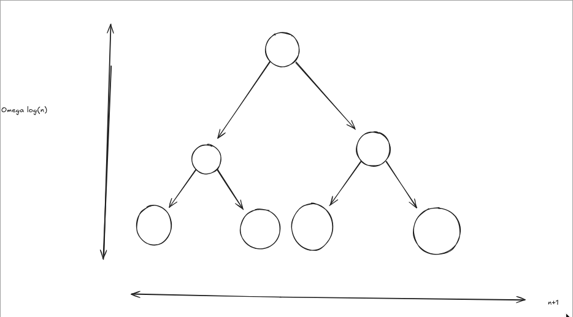

# Table of Contents

<!-- vim-markdown-toc GFM -->

* [Recap](#recap)
* [Sorting](#sorting)
    * [Comparision Model](#comparision-model)
    * [Sorting Problem](#sorting-problem)
    * [How Can We Use a DAA to Sort Faster?](#how-can-we-use-a-daa-to-sort-faster)
        * [DAA Sort](#daa-sort)
        * [Tuple Sort](#tuple-sort)
            * [Counting Sort](#counting-sort)

<!-- vim-markdown-toc -->
**Last Time**: 
* Comparision model => $\Omega$(log n) time to search
* Do faster using RAM and direct acess array (DAA)
    * The biggest limitation is that to store in a DAA we would need u elements in the array (u = universe of possible keys)
* Space O(u), reduce space via hash h(kp): u => N; 
    * To combat this we can reduce the space by passing them into a hash function; but this is limited by **hash colissions** ; hence we introduced the notion of hash families
* Expected O(1) time dictionary operations!

## Recap

| DS           | Container | Static    | Dynamic      | Order | Order |
|--------------|-----------|-----------|--------------|-------|-------|
| Array        | n         | n         | n            | n     | n     |
| Sorted Array | logn      | logn      | n            | 1     | log n |
| DAA          | n         | 1         | 1            | n     | n     |
| Hash Table   | $n_{(e)}$ | $1_{(e)}$ | $1_{(a)(e)}$ | n     | n     |

(e) = expected runtime ; (a) amortized runtime

---

The worst case is that the hash results in all collisions, which works the worst out of all DS.

If the range of keys are small or if we can choose the keys we can choose the range to be linear w/ respect to the items and we can favor using a DAA over a hash table
    * If all keys are unique then we can just traverse the array in linear time

## Sorting

| Algo           | Time 0(.) | In-place? | Stable? | Comments                    |
|----------------|-----------|-----------|---------|-----------------------------|
| Insertion Sort | $n^2$     | Y         | Y       | O(nk) for k-proximate       |
| Selection Sort | $n^2$     | Y         | N       | O(n) swaps                  |
| Merge Sort     | $nlogn$   | N         | Y       | stable, optimal comparision |

In comparision model nlogn is the best possible runtime

### Comparision Model

**Postulate**: Any model will take at least nlogn time. 
<!--  -->

We said that any algo in the comparision model
* some comparisions happen leading to branching
* where there are at least n+1 outputs
* and to search for the item would require traversing a the tree which would be at least $\Omega$(logn) time
    * Note the leaves in this tree represent an element



### Sorting Problem 

* What is the output of a sorting algorithim?
    * A list (itterable?), where the output is some permutation of that list
* How many possible outputs are there?
    * How many possible permutations exist?
        * [n, n-1, n-2, ..., n-i] = n!
        * So in sorting each following possition has 1 less possible outcomes than the prior index (since the previous index would account for one more possible value than the one following)
            * This can be expressed as n! possible outcomes; or in the contex of trees n! leaves
What this argument is saying is that if we replace n leaves with n! we get a similar comparision for traversing the tree of $\Omega(log n!):
    * recall stirling formula (n! ~ n log n)


### How Can We Use a DAA to Sort Faster?
Presume keys are unique and are of a small range

#### DAA Sort

Instantiate a large array of size u-1

I take each item to be sorted and place them into the DAA itteratively

**Make DAA** $O(u)$ ; u elements to create for empty arr.
```
0 [ ] [ ] [ ] [ ] [ ] [ ] [ ] [ ] u-1
```
**Store item x in index x.key** $O(n) * O(1)$ ; n elements to store in constant time
```
0 [ ] [ ] [ ] [k] [ ] [ ] [ ] [ ] u-1
```
**Walk down DAA and return items seen in order** $O(u)$ ; walking down length of u
```
0 [.] [.] [.] [k] [ ] [ ] [ ] [ ] u-1
```

What if we had a larger universe of keys?

$u=\theta n => O(n)$

$u < n^2$ This is a larger range; instantating a DAA of $n^2$ size we would have a $0(n^2)$

Maybe we could break this larger number into two smaller numbers, any interger from $0, n^2$ can be written as $k=(a,b)$
* Where a is the higher n; and b is the lower 
    * a = k//n
    * b = k%n
    * k = an+b


Say we have this list of numbers

n=5

[17, 3, 24, 22, 12]  => [(3,2),(0,3),(4,4),(4,2),(2,2)]
* (3*5)+2 = 17
* (0*5)+3 = 3
* (...*5)+... = ...

So how could we sort these tuples?
* The n-digit is the most significant digit
    * So we can sort by the largest digit (weak sort)

#### Tuple Sort

Sort n-digit first; then the 1-digit second; like an excel spreadsheet

[32,03,44,42,22]

---
**Sort n-digit**
[03,22,32,44,42]

**Sort 1-digit**
[22,32,42,03,44] ; note how this is implemented is destructive - to fix this we can change the ordering

---

**Sort 1-digit**
[32,42,22,03,44]

If a sorting algo retains the property that is x is the same thing then maintain their **relative order** this is called a **stable algorithim**

**Sort n-digit**
[03,22,32,42,44]

Because there's only two thing in the tuples we only need to use two passes; but we canno't use DAA sort here since the keys are not unique


##### Counting Sort
We can get around this by using the following:
```
0 [ ] [ ] [ ] [k] [ ] [ ] [ ] u-1
               |
              [ ]
```

```
[0] [1] [2] [3] [4] DAA (n)
 |       |    |   |
[03]    [22] [32] [42]
                  [44]
```
This also only takes O(n+u)

How many digits would we need to represent $n^3$

47:20
